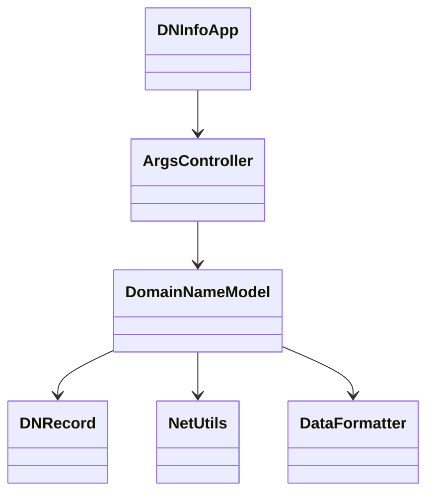
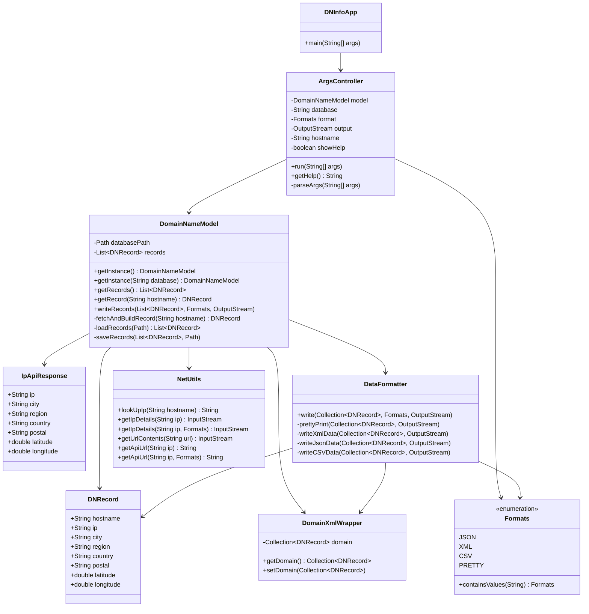

# Domain Information App Design Document

This document is meant to help you demonstrate your design process. You should work on it before coding and then revisit it after you have a finished product. That way, you can compare the changes; design changes are normal as you work through a project. Contrary to popular belief, we are not perfect on our first attempt. We need to iterate on our designs to make them better. This document is a tool to help you do that.

If you are using mermaid markup to generate your class diagrams, you may edit this document in the sections below to insert your markup to generate each diagram. Otherwise, you may simply include the images for each diagram requested below in your zipped submission (be sure to name each diagram image clearly in this case!)

## (INITIAL DESIGN): Class Diagram

Include a UML class diagram of your initial design for this assignment. If you are using the mermaid markdown, you may include the code for it here. For a reminder on the mermaid syntax, you may go [here](https://mermaid.js.org/syntax/classDiagram.html)

## (INITIAL DESIGN): Tests to Write - Brainstorm

Write a test (in english) that you can picture for the class diagram you have created. This is the brainstorming stage in the TDD process.

> [!TIP]
> As a reminder, this is the TDD process we are following:
> 1. Figure out a number of tests by brainstorming (this step)
> 2. Write **one** test
> 3. Write **just enough** code to make that test pass
> 4. Refactor/update  as you go along
> 5. Repeat steps 2-4 until you have all the tests passing/fully built program

You should feel free to number your brainstorm.
1. If I run the app with -h, it prints the help message.
2. If I ask for one hostname that already exists in the XML file, the app returns that saved record.
3. If I ask for a hostname that is not in the XML file, the app looks it up, adds it to the file, and prints it.
4. If I choose json format, the output is valid JSON with fields like hostname and ip.
5. If I run the app with no hostname, it prints all saved records.

## (FINAL DESIGN): Class Diagram

Go through your completed code, and update your class diagram to reflect the final design. We want both the diagram for your initial and final design, so you may include another image or include the finalized mermaid markup below. It is normal that the two diagrams don't match! Rarely (though possible) is your initial design perfect.

> [!WARNING]
> If you resubmit your assignment for manual grading, this is a section that often needs updating. You should double check with every resubmit to make sure it is up to date.

## (FINAL DESIGN): Reflection/Retrospective

> [!IMPORTANT]
> The value of reflective writing has been highly researched and documented within computer science, from learning new information to showing higher salaries in the workplace. For this next part, we encourage you to take time, and truly focus on your retrospective.

Take time to reflect on how your design has changed. Write in *prose* (i.e. do not bullet point your answers - it matters in how our brain processes the information). Make sure to include what were some major changes, and why you made them. What did you learn from this process? What would you do differently next time? What was the most challenging part of this process? For most students, it will be a paragraph or two.

### Reflection

My initial design started with a general sketch of the main classes and their relationships. My goal was to keep things simple by showing only the top-level connections between DNInfoApp, ArgsController, DomainNameModel, DNRecord, DataFormatter, and NetUtils. As I implemented the project, I added several supporting classes and inner types that I had not originally planned for, such as DomainXmlWrapper, the Formats enum, and the IpApiResponse helper class inside DomainNameModel. I made these additions because Jackson XML serialization required a wrapper object to produce the correct root element name, and having a dedicated response class made it much easier to deserialize the ipapi.co API results cleanly without mixing that logic into the main model.

From this process, I learned that designing up front is very valuable even when the design changes, because it forces you to think about responsibilities before writing code. I also learned how much serialization libraries such as Jackson rely on specific class structures, which impacted my design more than I expected.

If I did this assignment again, I would spend more time thinking about how Jackson annotations affect class design before writing the model, since I had to refactor the record structure a few times to get XML serialization and deserialization working correctly.

The most challenging part for me was getting XML loading and saving to work symmetrically, because the wrapper class needed to be set up just right for both reading and writing, and small mistakes in the annotations caused silent failures that were hard to debug.

Overall, my final design is better because it separates concerns more clearly: the model handles data loading and persistence, the formatter handles output, the controller handles argument parsing, and the network utilities are fully isolated.
